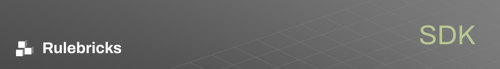

## Installation

To use the Rulebricks Go SDK in your project, you can install it using `go get`:

```sh
go get github.com/rulebricks/go-sdk
```

## Configuration

Before you can start using the SDK, you need to configure it with your Rulebricks API key. You can do this by creating a client with the `NewClient` function and passing in your API key as a request option:

```go
import (
    "github.com/rulebricks/go-sdk/client"
    "github.com/rulebricks/go-sdk/option"
    "net/http"
)

opts := option.WithAPIKey("YOUR_API_KEY")
client := client.NewClient(opts)
```

## Basic Usage

To solve a rule with the SDK, you can use the `Solve` function of the client. Here's an example of how to solve a rule identified by its unique slug:

```go
response, err := client.Rules.Solve(context.Background(), "rule-slug", map[string]interface{}{
    "data": "your-data-here",
})
if err != nil {
    // Handle error
}
// Use the response
```

For bulk operations, you can use the `BulkSolve` function to execute a rule against multiple data payloads:

```go
responses, err := client.Rules.BulkSolve(context.Background(), "rule-slug", []map[string]interface{}{
    {"data": "first-payload"},
    {"data": "second-payload"},
    // Add more payloads as needed
})
if err != nil {
    // Handle error
}
// Use the responses
```

To execute multiple rules in parallel, use the `ParallelSolve` function, along with the special parallel solve format:

```go
responses, err := client.Rules.ParallelSolve(context.Background(), map[string]interface{}{
    "eligibility":  {"$rule": "tJOCd8XX", "customer_id": "anc39as3", "purchase_history": []string{"t-shirt", "mug"}, "account_age_days": 4, "last_purchase_days_ago": 3, "email_subscription": false},
    "offers": {"$rule": "Ovms3XX", "customer_id": "anc39as3", "last_purchase_days_ago": 3, "selected_plan": "premium"},
    // Note the non top-level keyword $rule is used to identify the rule to be executed
    // alongside the data payload that should be passed to that particular rule
})
if err != nil {
    // Handle error
}
// Use the responses
```

## Asynchronous Usage

The SDK supports asynchronous operations using Go routines. You can use the `Solve`, `BulkSolve`, and `ParallelSolve` functions within a goroutine for concurrent rule solving:

```go
go func() {
    response, err := client.Rules.Solve(context.Background(), "rule-slug", map[string]interface{}{
        "data": "your-data-here",
    })
    if err != nil {
        // Handle error
    }
    // Use the response
}()
```

## Error Handling

The SDK returns errors that can be handled in a typical Go error handling pattern:

```go
response, err := client.Rules.Solve(...)
if err != nil {
    // Handle the error
}
```

## Feedback and Contributions

We welcome feedback and contributions to the SDK. Please report any issues or suggestions through the [GitHub issue tracker](https://github.com/rulebricks/go-sdk/issues).

For contributions, please submit a pull request with a clear description of the changes and any relevant tests.

## License

The Rulebricks Go SDK is released under the MIT License. See the LICENSE file for more details.
